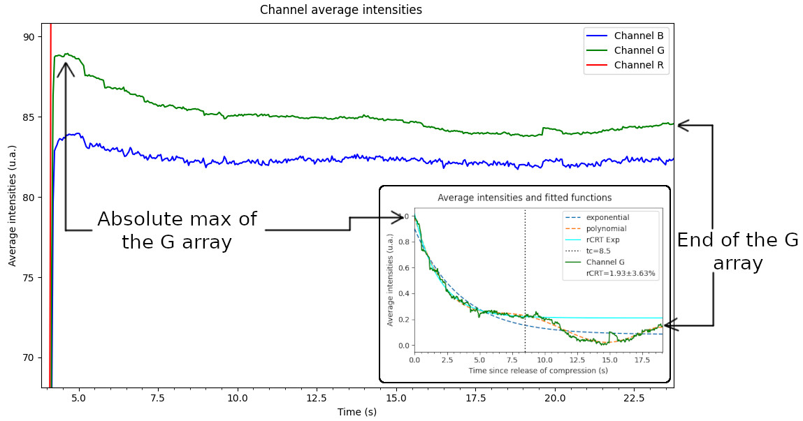
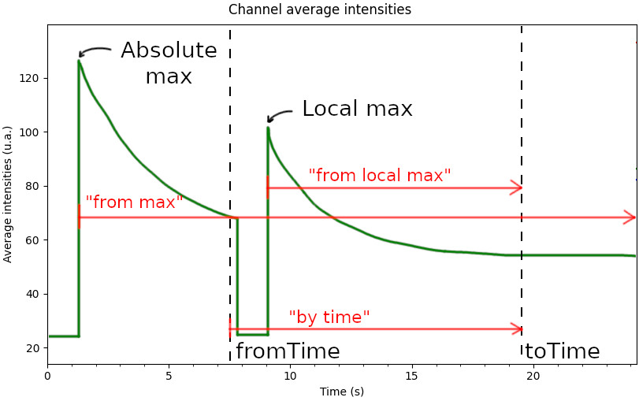

.. _pCRTcalculation:

Configuring the pCRT calculation
================================

pyCRT offers several options for configuring each step of the pCRT
calculation, most of which are accessible through arguments in the
:py:class:`RCRT` initialization methods (:py:meth:`RCRT.fromVideoFile`,
:py:meth:`RCRT.fromCaptureDevice` and :py:meth:`RCRT.__init__`). Most of these
options have *sensible* (for a some definition of "sensible") default values,
so you won't have to bother specifying each of them every time.

.. _channelOfInterest:

Channel of interest
-------------------

By *channel of interest* we mean the channel with respect to which the which
the pCRT will be calculated (see :doc:`Introduction to pCRT <introduction>`).
This channel can be specified by passing either "r", "g" or "b" to the
``channel`` argument:

.. sourcecode:: python

    from pyCRT import PCRT

    # Path to the video in the file system
    filePath = "video.wmv"

    # Uses the G channel by default
    pcrt_g = PCRT.fromVideoFile(filePath)

    # Uses the R channel
    pcrt_r = PCRT.fromVideoFile(filePath, channel="r")
    
    # The graph will be of the R channel
    pcrt_r.showAvgIntensPlot()

If no channel is specified, :py:class:`PCRT` will use the **G** channel by
default, for no other reason than that this channel showed higher
signal-to-noise ratio than the others for our measurements in the forearm.

.. _timeIntervals:

Time intervals
--------------

By default, ``pyCRT`` tries to fit the exponential and polynomial curves (see
:ref:`Algorithm for calculation <algorithm>` if this isn't clear) from the
instant of absolute maximum value of the :ref:`channel of interest
<channelOfInterest>`'s average intensities array, to the end of the array. 

The figure below (on the left) exemplifies this behaviour using the same plots
as shown on :ref:`Plotting Graphs <plottingGraphs>`. The main figure is a
magnified graph of the average intensities for each channel and the inset
is the resulting pCRT calculation and plot on the green channel.

This is a rather crude way of determining the interval in which the capillary
refill phenomenon occurs, and it is often necessary to manually specify this
interval. This can be done with the ``fromTime`` and ``toTime`` arguments:

.. sourcecode:: python

    from pyCRT import PCRT

    roi = (220, 170, 224, 145)
    filePath = "video.wmv"

    # Fitting on the interval between 5.5 and 12.5 s
    pcrt = PCRT.fromVideoFile(
        filePath, 
        roi=roi, 
        fromTime=5.5, 
        toTime=17.5, 
        sliceMethod="by time"
    )

In this example, the interval considered will from 6.5 to 19.5 seconds in the
recording. The parameter ``sliceMethod`` additionally determines the actual
interval that should be used, in the manner illustrated in the figure below.

The figure shows possible values for ``sliceMethod`` and the respective
intervals, in every case using the same ``fromTime`` and ``toTime``.

If either ``fromTime`` or ``toTime`` are not specified, ``pyCRT``'s default
behaviour is to use the beginning and the end of the array, respectively. For
example:

.. sourcecode:: python

    # toTime not specified
    pcrt = PCRT.fromVideoFile(
        filePath, roi=roi, fromTime=5.5, sliceMethod="from local max"
    )

This will fit the pCRT function from the instant of the maximum average
intensity that occurs after 5.5, to the end of the recording.

.. note::

    The ``fromTime`` and ``toTime`` arguments refer to **absolute** times,
    counting from the start of the recording, which is the X axis on the
    Channel Average Intensities graph. The X axis on the Average Intensities
    and Fitted Functions graph (wherein the pCRT is presented) is relative to
    ``fromTime``, so it starts at zero at the peak of the channel of
    interest's average intensities.

.. _initialGuesses:

Initial guesses
---------------

PyCRT's initial guesses for the parameters of the two exponential functions
(of the form ``A*exp(b*x)+c``) are ``A, b, c = 1.0, -0.3, 0.0``, and for the
sixth degree polynomial function the initial guesses were 0.0 for every
parameter (see :doc:`Introduction to pCRT <introduction>` for an explanation
of these functions). 

These values worked well for pCRT measurements on the forearm for our specific
setup but will probably be inadequate for other applications. As such, pyCRT
enables specifying the initial guesses for all parameters of each function.
For this, create a dictionary with the initial guesses for every function you
wish to specify and pass it as ``initialGuesses``, as in the example below:

.. sourcecode:: python

    from pyCRT import PCRT

    filePath = "video.wmv"

    # The parameters are in order of [A, b, c], for f(x)=A*exp(b*x)+c
    expGuesses = [0.8, -0.5, 0.2]

    # The parameters are in order of increasing polynomial exponent
    polyGuesses = [1.1, 2.3, 5.8, 13.21, 34.55, 89.144]

    # This refers to the second exponential function
    pcrtExpGuesses = [1.2, -0.1, -0.2]

    # The keys in this dictionary must be exactly these
    initialGuesses = {
        "exponential" : expGuesses,
        "polynomial": polyGuesses,
        "pCRT": pcrtExpGuesses,
    }

    pcrt = PCRT.fromVideoFile(filePath, initialGuesses=initialGuesses)

You can also omit one or two functions in the ``initialGuesses`` dictionary to
use their default initial guesses.

.. _exclusionCriteria:

Exclusion criteria
------------------

The *exclusion criteria* is the maximum relative uncertainty a pCRT
measurement to be acceptable. When pyCRT calculates an uncertainty grater than
this, it raises a ``RuntimeError``.

By default the exclusion criteria is arbitrarily defined as 0.12, and a custom
criteria can be specified through the ``exclusionCriteria`` argument:

.. sourcecode:: python
    
    # This will reject pcrt's with uncertainties greater than 20%
    pcrt = PCRT(timeScdsArr, avgIntensArr, exclusionCriteria=0.2)

If you don't want to use an exclusion criteria, you can set
``exclusionCriteria`` to an arbitrarily large value, or, better yet, use
`numpy.inf
<https://numpy.org/doc/stable/reference/constants.html#numpy.Inf>`_.

.. _criticalTime:

Critical time
-------------

PyCRT's default behaviour is to use the first peak of polynomial - exponential
function as the critical time (read :doc:`Introduction to pCRT <introduction>`
if you need an explanation). This can be changed through the ``criticalTime``
and ``exclusionMethod`` arguments.

You can either pass a single value or a list of values as the ``criticalTime``
argument. In the first case, pCRT calculation will be attempted with that
critical time regardless of the results of the exponential and polynomial fit.
When a list of critical values is passed, pyCRT will consider each value as a
*candidate* critical time, depending on the ``exclusionMethod`` parameter.

PyCRT always calculates the pCRT for each candidate critical time it finds
using the exponential - polynomial method or is provided through the
``criticalTime`` argument. The ``exclusionMethod`` option determines how pyCRT
chooses which candidate critical time to use. These are its possible values
and their effects:

* **"first that works"** (default): will return the first pCRT and its
  associated critical time that pass the :ref:`exclusion criteria
  <exclusionCriteria>`. By "first" it is meant the lowest critical time, that
  is, the first *chronologically*.

* **"best fit"**: will return the pCRT and associated critical time that gave
  the lowest uncertainty for the pCRT.

* **"strict"**: will only attempt to calculate the pCRT on the first critical
  time and fail if the results don't pass the exclusion criteria.
