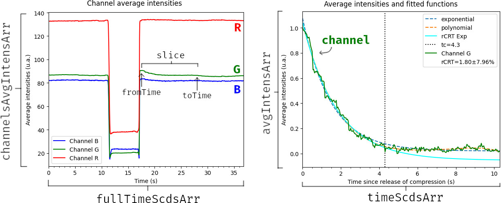

.. _propertiesPCRT:

Attributes of the PCRT object
=============================

These are some of the most useful attributes and properties of a PCRT object:

* **fullTimeScdsArr**: The entire array of timestamps, in seconds, extracted
  from a video file or a capture device, for example. Let's say this array has
  size *n* to contextualize the descriptions below.

* **channelsAvgIntensArr**: The entire array of pixel average intensities, for
  all 3 channels. This array has dimensions of 3 by *n*, as there are three
  values for each timestamp on ``fullTimeScdsArr``.

* **channel**: The channel that was selected for pCRT calculation. Can be
  either *b*, *g*, or *r*.

* **B**, **G**, and **R**: The arrays of pixel average intensities for the B,
  G and R channels respectively. Each is an *n* sized array.

* **slice**: A `slice object
  <https://docs.python.org/3/glossary.html#term-slice>`_ used for indexing
  ``fullTimeScdsArr`` and ``channelsAvgIntensArr``. This slice corresponds to
  the span of time wherein the CRT phenomenon occurs, that is, the section of
  the aforementioned arrays used for calculating pCRT.

* **fromTime** and **toTime**: The timestamps on ``fullTimeScdsArr``
  corresponding to the initial and final elements indexed by the ``slice``
  object above.

* **timeScdsArr**: The array of timestamps that correspond to the period
  wherein the CRT phenomenon occurs. In practice, this is ``fullTimeScdsArr``
  indexed by the ``slice`` object. Note that this array starts at zero, as its
  values are relative to the start of the CRT phenomenon (that is,
  ``fromTime``).

* **avgIntensArr**: The array of normalized pixel average intensities of the
  ``channel`` channel that correspond to the period wherein the CRT phenomenon
  occurs. This array has the same size as ``timeScdsArr``, and these arrays
  are the ones actually used for calculating pCRT.

* **expTuple**, **polyTuple** and **pCRTTuple**: The parameters and standard
  deviations of the exponential and polynomial functions used for calculating
  the pCRT. The parameters are in the order shown on :ref:`this section
  <initialGuesses>`.

* **pCRT**: The pCRT and its uncertainty with a 95% confidence interval.

* **relativeUncertainty**: The relative uncertainty. This is just the
  uncertainty divided by the pCRT.

* **criticalTime**: The critical time calculated along the pCRT.

All these similarly named attributes can be somewhat confusing at first, so
here's a figure illustrating what each of these attributes represent in the
*Channel Average Intensities* and *Average Intensities and Fitted Functions*
graphs:

|

.. note::
    
    The PCRT class wasn't designed to be modified after it is instantiated.
    Instead of changing one or more attributes of an already existing PCRT
    object, it is best to create new PCRT objects for every change. The
    following snippet of code is a very common and useful pattern:

        .. sourcecode:: python
            
            from pyCRT import PCRT

            videoPath = "video.wmv"

            # Using this object just to read from a file
            pcrt = PCRT.fromVideoFile("video.wmv")

            # Storing the most important arrays for later use
            fullTimeScdsArr = pcrt.fullTimeScdsArr
            channelsAvgIntensArr = pcrt.channelsAvgIntensArr

            # Testing different options for the same data
            pcrtRed = PCRT(
                fullTimeScdsArr, channelsAvgIntensArr, channel="r"
            )
            pcrt2 = PCRT(
                fullTimeScdsArr, channelsAvgIntensArr, criticalTime=17.8
            )
