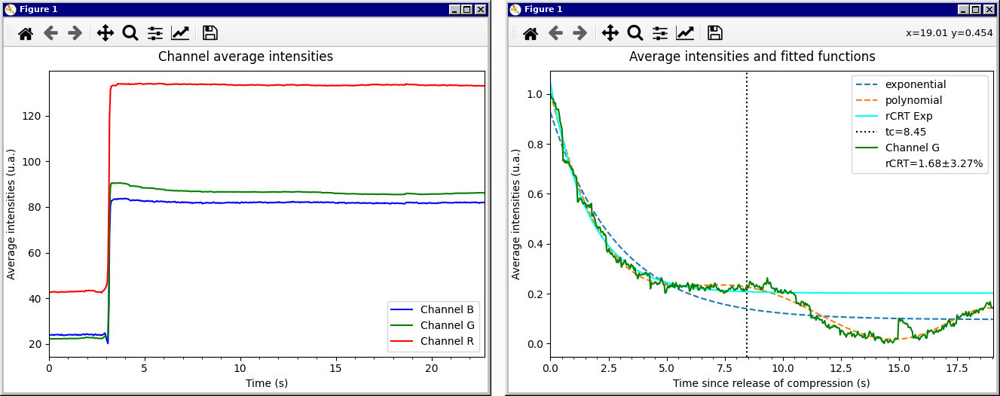

===========
Basic Usage
===========

.. _installation:

Installation
============

Install pyrCRT through pip, preferably in a `virtual environment
<https://docs.python.org/3/tutorial/venv.html>`_:

.. sourcecode:: shell
    
    $ pip install pyCRT

.. _readingVideoFiles:

Reading video files
===================

PyCRT's main user interface is its :py:class:`pyrCRT.RCRT` class, which
represents a single measurement. To calculate the rCRT from a video file, for
example, the following code is all that is strictly necessary:

.. sourcecode:: python

    from pyCRT import PCRT

    # Path to the video in the file system
    filePath = "video.wmv"

    pcrt = PCRT.fromVideoFile(filePath)

At this point a window with video playback will appear. In order to select a
*region of interest* (ROI), press the space bar at any moment and the video
will pause, allowing you to drag a square around the desired ROI.

Press the space bar again to confirm the selection and the video will resume.
You'll notice a 4 elements tuple printed on the terminal after confirming the
ROI. This tuple specifies the ROI, and can be passed to
:py:meth:`RCRT.fromVideoFile` method via the ``roi`` keyword argument to
avoid having to manually select the ROI next time.

If the ROI is already specified via the keyword argument, you can disable the
exhibition of the video playback, which speeds up computation:

.. sourcecode:: python
    
    from pyCRT import PCRT

    roi = (220, 170, 224, 145)
    filePath = "video.wmv"

    pcrt = PCRT.fromVideoFile(filePath, roi=roi, displayVideo=False)

After the video ends, the window closes automatically and pyrCRT attempts to
calculate the rCRT. The rCRT and its 0.95 confidence interval uncertainty are
attributes of the rCRT instance created through the
:py:meth:`RCRT.fromVideoFile` method, which is now stored by the ``rcrt``
variable:

.. sourcecode:: python

    >>> print(pcrt)
    1.68±3.27%
    >>> print(pcrt.pCRT) # the second element is the absolute uncertainty
    (1.6790549329488764, 0.054861676836145)

To reduce the video processing load on slower machines or with high-resolution
videos, you can set the ``rescaleFactor`` keyword argument to a number between
0 and 1. Of course, you can also upscale the video likewise.

.. _readingVideoCamera:

Reading from a video camera
===========================

Calculating the pCRT from the live feed of a video camera (such as a webcam)
is also simple. Use :py:meth:`RCRT.fromCaptureDevice`:

.. sourcecode:: python

    from pyCRT import PCRT

    captureDevice = 0

    pcrt = PCRT.fromCaptureDevice(captureDevice)

This will open a window with video playback from the specified
``captureDevice``. Each connected capture device recognized by OpenCV
corresponds to a different integer. If you have a single webcam connected, it
will most likely correspond to **0**. You can also list and use the first
available device with :py:meth:`pyrCRT.videoReading.listCaptureDevices`:

.. sourcecode:: python

    from pyCRT.videoReading import listCaptureDevices

    captureDevice = listCaptureDevices()[0]

Most options available as keyword arguments for :py:meth:`RCRT.fromVideoFile`
are also valid for :py:meth:`RCRT.fromCaptureDevice`, except for
``displayVideo``, as the user is required to press the **q** key to terminate
the video playback and enable calculation of the pCRT.
:py:meth:`RCRT.fromVideoFile`'s exclusive options are ``cameraResolution``,
``recordingPath``, ``codecFourcc`` and ``recordingFps``:

.. sourcecode:: python
    
    from pyCRT import PCRT

    captureDevice = 0
    roi = (220, 170, 224, 145)

    cameraResolution = (640, 480)
    recordingPath = "recording.mp4"
    codecFourcc = "mp4v"
    recordingFps = 30.0

    pcrt = PCRT.fromCaptureDevice(
        captureDevice, 
        roi, 
        cameraResolution, 
        recordingPath, 
        codecFourcc,
        recordingFps
    )

When a ``recordingPath`` is specified, pyCRT will record the camera's output
on that file using the codec specified by ``codecFourcc`` and with
``recordingFps`` FPS ("mp4v" and 30.0 by default, respectively). The desired
codec must be identified by its FOURCC string (refer to
`<www.fourcc.org/codecs.php>`_ for a list of codecs and their FOURCC strings).
Note that the file extension on ``recordingPath`` is meaningful and will
correspond to the recording's container, which must be compatible with the
codec. In doubt, just stick to the defaults.

The ``cameraResolution`` parameter specifies the camera's resolution. Not
every camera can change its resolution. Also note that this argument is
unrelated the ``rescaleFactor`` presented in the section above --
``cameraResolution`` changes the camera's output resolution while
``rescaleFactor`` rescales each frame after they are read from the camera.

    
.. _pCRTFromArrays:

Calculating pCRT from arrays
============================

Often the video reading methods the :py:class:`pyrCRT.RCRT` class provides are
not adequate for a specific problem, and calculating the CRT from average
channel intensities and times arrays obtained from some other method is
necessary. For that, :py:class:`pyrCRT.RCRT`'s default init method is used:

.. sourcecode:: python

    import numpy as np
    from pyCRT import PCRT

    # Creating some arbitrary arrays for illustration
    timeScdsArr = np.linspace(0, 1, 100)
    avgIntensArr = np.array([[n, n*2, n*3 for n in np.exp(-timeScdsArr)])

    pcrt = PCRT(timeScdsArr, avgIntensArr)

The calculation above will most likely fail on the arbitrary arrays created
for the purposes of this demonstration. 

The most important arguments of this init method, which can also be used on
the other init methods, are presented on the section :ref:`Configuring the
pCRT calculation <pCRTcalculation>` below.

.. _plottingGraphs:

Plotting graphs
===============

To view graphs of the pixel average intensities inside the ROI for each
channel, and of the curve fits performed on the channel with which the rCRT is
calculated (G, by default), use :py:meth:`pyrCRT.RCRT.showAvgIntensPlot` and
:py:meth:`pyrCRT.RCRT.showRCRTPlot`:

.. sourcecode:: python

    rcrt.showAvgIntensPlot()
    rcrt.showRCRTPlot()

This will produce the following two graphs, respectively:

To save these graphs to a file, you can either click on the *save* button in
the plot display window (like the two windows shown above), or use
:py:meth:`pyrCRT.RCRT.saveAvgIntensPlot` and
:py:meth:`pyrCRT.RCRT.saveRCRTPlot`:

.. sourcecode:: python

    rcrt.saveAvgIntensPlot("avg_intens.png")
    rcrt.saveRCRTPlot("g_rcrt_fit.png")

This will save each plot as PNG images in the specified path without showing
the plot display window.

.. include:: configuring.rst

.. include:: propertiesPCRT.rst

.. _storingMeasurements:

Storing and retrieving measurements
===================================

PyCRT natively supports storing pCRT measurements in a *npz-compressed* file
that is retrievable by pyCRT. For that, use :py:meth:`RCRT.save` and
:py:meth:`RCRT.fromArchive`:

.. sourcecode:: python

    from pyCRT import PCRT

    pcrt = PCRT.fromVideoFile("video.wmv")

    # Storing the measurement
    pcrt.save("pcrt-backup.npz")

    # Loading a measurement
    pcrt2 = RCRT.fromArchive("pcrt-backup.npz")
